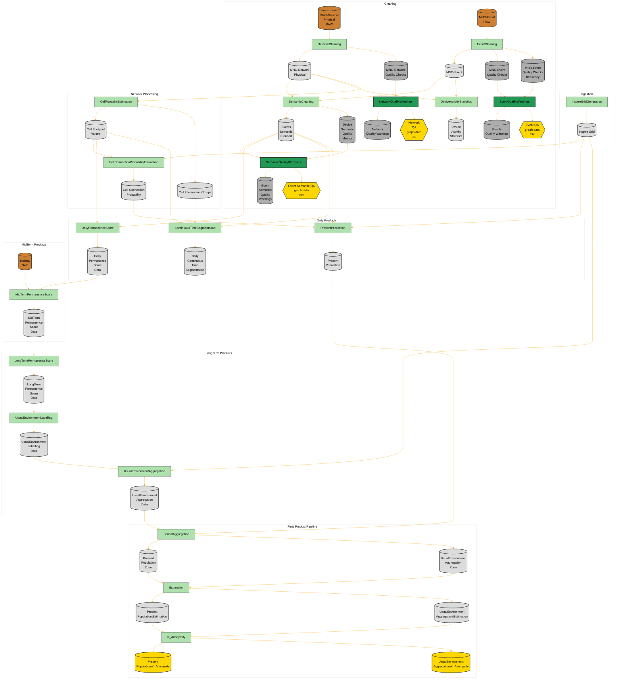

---
hide:
  - navigation
  - toc
---

# Pipeline

The software can perform the following pipeline:

```mermaid
%%{
  init: {
    'theme': 'base',
    'themeVariables': {
      'primaryColor': '#BB2528',
      'primaryTextColor': '#000000',
      'primaryBorderColor': '#7C0000',
      'lineColor': '#F8B229',
      'secondaryColor': '#006100',
      'tertiaryColor': '#fff'
    }
  }
}%%
flowchart TD;
    %% --- Reference Data ---
    %% Inspire grid generation
    subgraph Ingestion
    InspireGridGeneration-->InspireGridData[(Inspire Grid\n)];
    end
    %% --- MNO Data ---
    %% -- NETWORK --
    subgraph Cleaning
    %% RAW Network cleaning
    PhysicalNetworkRAWData[(MNO-Network\nPhysical\nRAW)]-->NetworkCleaning-->PhysicalNetworkData[(MNO-Network\nPhysical)];
    NetworkCleaning-->NetworkQAData[(MNO-Network\nQuality Checks)];
    %% RAW Network QA
    NetworkQAData-->NetworkQualityWarnings-->NetworkWarnings[(Network\nQuality Warnings)];
    NetworkQualityWarnings-->NetworkReports{{Network\nQA \ngraph data\ncsv}};
    %% -- EVENTS --
    %% RAW Events cleaning
    EventsRAWData[(MNO-Event\nRAW)]-->EventCleaning-->EventsData[(MNO-Event)];
    EventCleaning-->EventsQA[(MNO-Event\nQuality Checks)]-->EventQualityWarnings;
    EventCleaning-->EventsQAfreq[(MNO-Event\nQuality Checks\nfrequency)];
    %% RAW Events Warnings
    EventsQAfreq-->EventQualityWarnings;
    EventQualityWarnings-->EventsWarnings[(Events\nQuality Warnings)];
    EventQualityWarnings-->EventsReports{{Event QA \ngraph data\ncsv}};
    %% Event Semantic Checks
    EventsData-->SemanticCleaning-->EventsSemanticCleaned[(Events\nSemantic\nCleaned)];
    PhysicalNetworkData-->SemanticCleaning;
    SemanticCleaning-->DeviceSemanticQualityMetrics[(Device\nSemantic\nQuality\nMetrics)];
    %% Event Semantic Warnings
    EventsSemanticCleaned-->SemanticQualityWarnings-->EventSemanticWarnings[(Event\nSemantic\nQuality\nWarnings)];
    DeviceSemanticQualityMetrics-->SemanticQualityWarnings-->EventSemanticReports{{Event Semantic QA \ngraph data\ncsv}};
    %% Device activity Statistics
    EventsData-->DeviceActivityStatistics-->DeviceActivityStatisticsData[(Device\nActivity\nStatistics)];
    PhysicalNetworkData-->DeviceActivityStatistics;
    end
    

    subgraph Network Processing
    %% Cell Footprint
    PhysicalNetworkData-->CellFootprintEstimation-->CellFootprintData[(Cell Footprint\nValues)];
    CellFootprintEstimation-->CellIntersectionGroupsData[(Cell Intersection Groups)];
    %% Cell Connection Probability
    CellFootprintData-->CellConnectionProbabilityEstimation;
    InspireGridData-->CellConnectionProbabilityEstimation-->CellConnectionProbabilityData[(Cell Connection\nProbability)];
    end
    
    subgraph Daily Products
    %% --- Daily Processing module ---
    %% Daily Permanence Score
    EventsSemanticCleaned-->DailyPermanenceScore-->DPSdata[(Daily\nPermanence\nScore\nData)];
    CellFootprintData-->DailyPermanenceScore;
    %% Continuous Time segmentation
    EventsSemanticCleaned-->ContinuousTimeSegmentation-->DailyCTSdata[(Daily\nContinuous\nTime\nSegmentation)];
    CellFootprintData-->ContinuousTimeSegmentation;
    CellIntersectionGroupsData-->ContinuousTimeSegmentation;
    %% Present Population Estimation
    EventsSemanticCleaned-->PresentPopulation-->PresentPopulationData[(Present\nPopulation)];
    CellConnectionProbabilityData-->PresentPopulation;
    InspireGridData-->PresentPopulation;
    end

    %% --- Longitudinal module ---
    subgraph MidTerm Products
    %% Midterm Permanence Score
    HolidayData[(Holiday\nData)]
    DPSdata-->MidTermPermanenceScore-->MPSdata[(MidTerm\nPermanence\nScore\nData)];
    HolidayData-->MidTermPermanenceScore;
    end

    %% [LONGTERM]
    subgraph LongTerm Products
    %% Longterm Permanence Score
    MPSdata-->LongTermPermanenceScore-->LPSdata[(LongTerm\nPermanence\nScore\nData)];
    LPSdata-->UsualEnvironmentLabelling-->UELdata[(UsualEnvironment\nLabelling\nData)];
    UELdata-->UsualEnvironmentAggregation-->UEAdata[(UsualEnvironment\nAggregation\nData)];
    InspireGridData-->UsualEnvironmentAggregation;
    end

    subgraph Final Product Pipeline
    %% Spatial Aggregation
    PresentPopulationData-->SpatialAggregation-->PresentPopulationZoneData[(Present\nPopulation\nZone)];
    UEAdata-->SpatialAggregation-->UEAZoneData[(UsualEnvironment\nAggregation\nZone)]

    %% Estimation
    PresentPopulationZoneData-->Estimation-->PresentPopulationEstimationData[(Present\nPopulation\Estimation)];
    UEAZoneData-->Estimation-->UEAEstimationData[(UsualEnvironment\nAggregation\Estimation)]

    %% K-Anonymity
    PresentPopulationEstimationData-->K_Anonymity-->PresentPopulationK_AnonymityData[(Present\nPopulation\K_Anonymity)];
    UEAEstimationData-->K_Anonymity-->UEAK_AnonymityData[(UsualEnvironment\nAggregation\K_Anonymity)]
    end

    classDef green fill:#229954,stroke:#333,stroke-width:2px;
    classDef light_green fill:#AFE1AF,stroke:#333,stroke-width:1px;
    classDef bronze fill:#CD7F32,stroke:#333,stroke-width:2px;
    classDef silver fill:#adadad,stroke:#333,stroke-width:2px;
    classDef light_silver fill:#dcdcdc,stroke:#333,stroke-width:2px;
    classDef gold fill:#FFD700,stroke:#333,stroke-width:2px;

    %% ++++++++++++++++ BRONZE ++++++++++++++++
    class PhysicalNetworkRAWData,EventsRAWData bronze
    class HolidayData bronze

    %% ++++++++++++++++ SILVER ++++++++++++++++
    %% --- Reference Data ---
    class InspireGridData light_silver
    %% --- MNO Data ---
    %% -- NETWORK --
    class PhysicalNetworkData light_silver
    class NetworkQAData,NetworkWarnings silver
    class CellFootprintData,CellConnectionProbabilityData,CellIntersectionGroupsData light_silver
    %% -- EVENTS --
    %% event cleaning
    class EventsData light_silver
    class EventsQA,EventsQAfreq,EventsWarnings silver

    %% event deduplicated
    class EventsDeduplicated light_silver
    class EventsDeduplicatedQA,EventsDeduplicatedQAfreq,EventsDeduplicatedWarnings silver

    %% device activity statistics
    class DeviceActivityStatisticsData light_silver
    %% events semantic clean
    class EventsSemanticCleaned light_silver
    class DeviceSemanticQualityMetrics,EventSemanticWarnings silver

    %% Present population
    class PresentPopulationData light_silver
    %% --- Daily Processing module ---
    %% Daily Permanence Score
    class DPSdata light_silver
    %% Continuous Time segmentation
    class DailyCTSdata light_silver
    %% Longitudinal data
    class MPSdata,LPSdata light_silver
    %% UE data
    class UELdata,UEAdata light_silver
    %% Final components data
    class PresentPopulationZoneData,UEAZoneData light_silver
    class PresentPopulationEstimationData,UEAEstimationData light_silver

    %% ++++++++++++++++ GOLD ++++++++++++++++
    class NetworkReports gold
    class EventsDeduplicatedReports gold
    class EventsReports gold
    class EventSemanticReports gold
    class PresentPopulationK_AnonymityData,UEAK_AnonymityData gold

    %% ---- Components ----
    class InspireGridGeneration light_green
    %% Net
    class NetworkCleaning,CellFootprintEstimation,CellConnectionProbabilityEstimation light_green
    class NetworkQualityWarnings green
    %% Events
    class EventCleaning,EventDeduplication,SemanticCleaning light_green
    class EventQualityWarnings,EventQualityWarnings2,SemanticQualityWarnings green
    %% -> Device Activity Statistics should start from semantic cleaned events
    class DeviceActivityStatistics light_green
    %% Daily
    class DailyPermanenceScore,ContinuousTimeSegmentation,PresentPopulation light_green
    %% Longitudinal - Midterm
    class MidTermPermanenceScore light_green
    class LongTermPermanenceScore,UsualEnvironmentLabelling,UsualEnvironmentAggregation light_green
    %% Final products pipeline
    class SpatialAggregation,Estimation,K_Anonymity light_green
```

