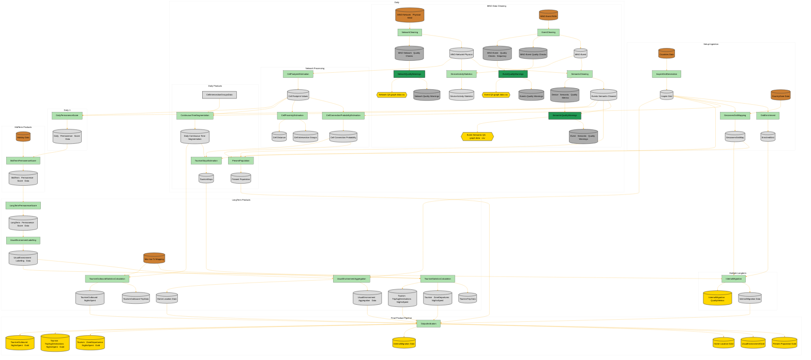

---
hide:
  - navigation
  - toc
---

# Pipeline

```mermaid
%%{
  init: {
    'theme': 'base',
    'themeVariables': {
      'primaryColor': '#BB2528',
      'primaryTextColor': '#000000',
      'primaryBorderColor': '#7C0000',
      'lineColor': '#F8B229',
      'secondaryColor': '#006100',
      'tertiaryColor': '#fff'
    }
  }
}%%
flowchart TD;
    %% --- Reference Data ---
    subgraph Setup-Ingestion
    %% [SETUP ONCE]
    %% <Grid Setup>

    %% Inspire grid generation
    CountriesData[(Countries Data)]-->InspireGridGeneration-->InspireGridData[(Inspire Grid)];
    %% GridEnrichment
    InspireGridData-->GridEnrichment-->EnrichedGrid[(EnrichedGrid   )];
    %% GeozonesGridMapping
    InspireGridData-->GeozonesGridMapping-->GeozonesGridMap[(GeozonesGridMap)]
    CountryZoneData[(CountryZone Data)]-->GeozonesGridMapping
    end

    subgraph Daily
    subgraph MNO-Data Cleaning
    %% [DAILY]
    %% <MNO Data Cleaning>
    %% RAW Network cleaning
    PhysicalNetworkRAWData[(MNO-Network   Physical   RAW)]-->NetworkCleaning-->PhysicalNetworkData[(MNO-Network   Physical)];
    NetworkCleaning-->NetworkQAData[(MNO-Network   Quality Checks)];
    %% RAW Network QA
    NetworkQAData-->NetworkQualityWarnings-->NetworkWarnings[(Network   Quality Warnings)];
    NetworkQualityWarnings-->NetworkReports{{Network   QA    graph data   csv}};
    %% -- EVENTS --
    %% RAW Events cleaning
    EventsRAWData[(MNO-Event   RAW)]-->EventCleaning-->EventsData[(MNO-Event)];
    EventCleaning-->EventsQA[(MNO-Event   Quality Checks)]-->EventQualityWarnings;
    EventCleaning-->EventsQAfreq[(MNO-Event   Quality Checks   frequency)];
    %% RAW Events Warnings
    EventsQAfreq-->EventQualityWarnings;
    EventQualityWarnings-->EventsWarnings[(Events   Quality Warnings)];
    EventQualityWarnings-->EventsReports{{Event QA    graph data   csv}};
    %% Event Semantic Checks
    EventsData-->SemanticCleaning-->EventsSemanticCleaned[(Events   Semantic   Cleaned)];
    PhysicalNetworkData-->SemanticCleaning;
    SemanticCleaning-->DeviceSemanticQualityMetrics[(Device   Semantic   Quality   Metrics)];
    %% Event Semantic Warnings
    EventsSemanticCleaned-->SemanticQualityWarnings-->EventSemanticWarnings[(Event   Semantic   Quality   Warnings)];
    DeviceSemanticQualityMetrics-->SemanticQualityWarnings-->EventSemanticReports{{Event Semantic QA    graph data   csv}};
    %% Device activity Statistics
    EventsData-->DeviceActivityStatistics-->DeviceActivityStatisticsData[(Device   Activity   Statistics)];
    PhysicalNetworkData-->DeviceActivityStatistics;
    end
    

    subgraph Network Processing
    %% [DAILY]
    %% <Network Coverage>
    %% Cell Footprint
    PhysicalNetworkData-->CellFootprintEstimation-->CellFootprintData[(Cell Footprint Values)];
    %% Cell Connection Probability
    CellFootprintData-->CellConnectionProbabilityEstimation;
    InspireGridData-->CellConnectionProbabilityEstimation-->CellConnectionProbabilityData[(Cell Connection Probability)];
    %% Cell Proximity Estimation
    CellFootprintData-->CellProximityEstimation-->CellIntersectionsGroupsData[(Cell Intersection Groups)]
    CellProximityEstimation-->CellDistanceData[(Cell Distance)]
    end
    
    subgraph Daily Products
    %% [DAILY]
    %% <Present Population Estimation>
    EventsSemanticCleaned-->PresentPopulation-->PresentPopulationData[(Present   Population)];
    CellConnectionProbabilityData-->PresentPopulation;
    InspireGridData-->PresentPopulation;

    %% <Tourism>
    %% Continuous Time segmentation
    EventsSemanticCleaned-->ContinuousTimeSegmentation-->DailyCTSdata[(Daily Continuous Time Segmentation)];
    CellFootprintData-->ContinuousTimeSegmentation;
    CellIntersectionGroupsData-->ContinuousTimeSegmentation;
    %% Tourism Stays estimation
    DailyCTSdata-->TourismStaysEstimation-->TourismStaysData[(TourismStays)];
    CellConnectionProbabilityData-->TourismStaysEstimation;
    GeozonesGridMap-->TourismStaysEstimation;
    end
    end

    subgraph Daily-1
    %% [DAILY-1]
    %% <Usual Environment>

    %% Daily Permanence Score
    EventsSemanticCleaned-->DailyPermanenceScore-->DPSdata[(Daily   Permanence   Score   Data)];
    CellFootprintData-->DailyPermanenceScore;
    end

    %% --- Longitudinal module ---
    subgraph MidTerm Products
    %% [MIDTERM]
    %% <Usual Environment>

    %% Midterm Permanence Score
    HolidayData[(Holiday   Data)]
    DPSdata-->MidTermPermanenceScore-->MPSdata[(MidTerm   Permanence   Score   Data)];
    HolidayData-->MidTermPermanenceScore;
    end

    subgraph LongTerm Products
    %% [LONGTERM]
    %% <Usual Environment>

    %% Longterm Permanence Score
    MPSdata-->LongTermPermanenceScore-->LPSdata[(LongTerm   Permanence   Score   Data)];
    %% UE-L
    LPSdata-->UsualEnvironmentLabelling-->UELdata[(UsualEnvironment   Labelling   Data)];
    %% UE-A
    UELdata-->UsualEnvironmentAggregation-->UEAdata[(UsualEnvironment   Aggregation   Data)];
    InspireGridData-->UsualEnvironmentAggregation;
    UsualEnvironmentAggregation-->HomeLocationData[(Home Location   Data)]

    %% <Tourism>

    %% Tourism Inbound
    %% INPUT: <MccIsoTz>
    MccIsoTzMap[(Mcc-Iso-Tz Mapping)]
    %% 
    MccIsoTzMap-->TourismStatisticsCalculation-->TourismTripData[(TourismTrip   Data)];
    TourismStaysData-->TourismStatisticsCalculation;
    TourismStatisticsCalculation-->TourismZoneDeparturesNightsSpentData[(Tourism   ZoneDepartures   NightsSpent)];
    TourismStatisticsCalculation-->TourismTripAvgDestinationsNightsSpentData[(Tourism   TripAvgDestinations   NightsSpent)];
    %% Tourism Outbound
    DailyCTSdata-->TourismOutboundStatisticsCalculation;
    MccIsoTzMap-->TourismOutboundStatisticsCalculation-->TourismOutboundTripData[(TourismOutbound   TripData)];
    TourismOutboundStatisticsCalculation-->TourismOutboundNightsSpentData[(TourismOutbound   NightsSpent)]
    end


    subgraph Multiple Longterm
    %% [MULTIPLE LONGTERM]
    %% < Internal Migration >
    EnrichedGrid-->InternalMigration-->InternalMigrationData[(InternalMigration Data)];
    GeozonesGridMap-->InternalMigration;
    UELdata-->InternalMigration;
    InternalMigration-->InternalMigrationQM[(InternalMigration   QualityMetrics)]

    end


    subgraph Final Product Pipeline
    %% [OUTPUT INDICATORS]
    %% - Present Population
    PresentPopulationData-->OutputIndicators-->PresentPopulationGold[(Present   Population   Gold)];
    %% - Usual Environment
    UEAdata-->OutputIndicators-->UEADataGold[(UsualEnvironment\Gold)]
    %% - Home location
    HomeLocationData-->OutputIndicators-->HomeLocationDataGold[(Home Location   Gold)]
    %% Internal Migration
    InternalMigrationData-->OutputIndicators-->InternalMigrationDataGold[(InternalMigration   Gold)]
    %% Tourism Inbound
    TourismZoneDeparturesNightsSpentData-->OutputIndicators-->TourismZoneDeparturesNightsSpentDataGold[(Tourism   ZoneDeparturesn   NightsSpent   Gold)]
    TourismTripAvgDestinationsNightsSpentData-->OutputIndicators-->TourismTripAvgDestinationsNightsSpentDataGold[(Tourism   TripAvgDestinations   NightsSpent   Gold)]
    %% Tourism Outbound
    TourismOutboundNightsSpentData-->OutputIndicators-->TourismOutboundNightsSpentDataGold[(TourismOutbound   NightsSpent   Gold)]
    end

    classDef green fill:#229954,stroke:#333,stroke-width:2px;
    classDef light_green fill:#AFE1AF,stroke:#333,stroke-width:1px;
    classDef bronze fill:#CD7F32,stroke:#333,stroke-width:2px;
    classDef silver fill:#adadad,stroke:#333,stroke-width:2px;
    classDef light_silver fill:#dcdcdc,stroke:#333,stroke-width:2px;
    classDef gold fill:#FFD700,stroke:#333,stroke-width:2px;

    %% ++++++++++++++++ BRONZE ++++++++++++++++
    class PhysicalNetworkRAWData,EventsRAWData bronze
    class CountriesData,CountryZoneData bronze
    class HolidayData,MccIsoTzMap bronze

    %% ++++++++++++++++ SILVER ++++++++++++++++
    %% --- Reference Data ---
    class InspireGridData,EnrichedGrid,GeozonesGridMap light_silver
    %% --- DAILY - CLEANING ---
    %% -- NETWORK --
    class PhysicalNetworkData light_silver
    class NetworkQAData,NetworkWarnings silver
    class CellFootprintData,CellConnectionProbabilityData,CellIntersectionGroupsData light_silver
    class CellIntersectionsGroupsData,CellDistanceData light_silver
    %% -- EVENTS --
    %% event cleaning
    class EventsData light_silver
    class EventsQA,EventsQAfreq,EventsWarnings silver

    %% event deduplicated
    class EventsDeduplicated light_silver
    class EventsDeduplicatedQA,EventsDeduplicatedQAfreq,EventsDeduplicatedWarnings silver

    %% device activity statistics
    class DeviceActivityStatisticsData light_silver
    %% events semantic clean
    class EventsSemanticCleaned light_silver
    class DeviceSemanticQualityMetrics,EventSemanticWarnings silver

    %% --- DAILY - PP ---
    %% Present population
    class PresentPopulationData light_silver
    %% --- DAILY - UE ---
    %% Daily Permanence Score
    class DPSdata light_silver
    %% --- DAILY - TOURISM ---
    %% Continuous Time segmentation
    class DailyCTSdata,TourismStaysData light_silver

    %% --- MIDTERM - UE ---
    %% Midterm Permanence Score
    class MPSdata light_silver
    
    %% --- LONGTERM - UE ---
    %% Longterm Permanence Score
    class LPSdata light_silver
    %% UE data
    class UELdata,UEAdata,HomeLocationData light_silver
    %% --- LONGTERM - TOURISM ---
    %% Inbound
    class TourismTripData,TourismZoneDeparturesNightsSpentData,TourismTripAvgDestinationsNightsSpentData light_silver
    %% Outbound
    class TourismOutboundTripData,TourismOutboundNightsSpentData light_silver

    %% --- MULTIPLE LONGTERM - Internal Migration ---
    class InternalMigrationData light_silver

    %% ++++++++++++++++ GOLD ++++++++++++++++

    %% Reports
    class NetworkReports gold
    class EventsDeduplicatedReports gold
    class EventsReports gold
    class EventSemanticReports gold
    class InternalMigrationQM gold

    %% Present Population
    class PresentPopulationGold gold
    %% Usual Environment
    class UEADataGold,HomeLocationDataGold gold
    %% Tourism - Inbound
    class TourismZoneDeparturesNightsSpentDataGold,TourismTripAvgDestinationsNightsSpentDataGold gold
    %% Tourism - Outbound
    class TourismOutboundNightsSpentDataGold gold
    %% Internal migration
    class InternalMigrationDataGold gold

    %% ++++++++++++++++ Components ++++++++++++++++
    %% [SETUP ONCE]
    class InspireGridGeneration,GridEnrichment,GeozonesGridMapping light_green

    %% [DAILY]
    %% <MNO Data Cleaning>
    class NetworkCleaning light_green
    class NetworkQualityWarnings green
    %% Events
    class EventCleaning,EventDeduplication,SemanticCleaning light_green
    class EventQualityWarnings,EventQualityWarnings2,SemanticQualityWarnings green
    %% -> Device Activity Statistics should start from semantic cleaned events
    class DeviceActivityStatistics light_green
    %% <Network Coverage>
    class CellFootprintEstimation,CellConnectionProbabilityEstimation,CellProximityEstimation light_green
    %% <Present Population Estimation>
    class PresentPopulation light_green
    %% <Tourism>
    class ContinuousTimeSegmentation,TourismStaysEstimation light_green

    %% [DAILY-1]
    %% <Usual Environment>
    class DailyPermanenceScore light_green

    %% [MIDTERM]
    %% <Usual Environment>
    class MidTermPermanenceScore light_green

    %% [LONGTERM]
    %% <Usual Environment>
    class LongTermPermanenceScore,UsualEnvironmentLabelling,UsualEnvironmentAggregation light_green
    %% <Tourism>
    %% Tourism Inbound
    class TourismStatisticsCalculation light_green
    %% Tourism Outbound
    class TourismOutboundStatisticsCalculation light_green

    %% [MULTIPLE LONGTERM]
    %% < Internal Migration >
    class InternalMigration light_green

    %% [OUTPUT INDICATORS]
    class OutputIndicators light_green
    
```
